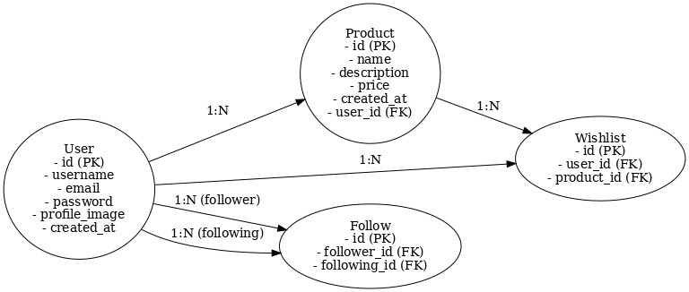

# Sparta Market

## 프로젝트 소개
스파르타 마켓은 사용자 간 중고 물품 거래를 지원하는 웹 애플리케이션입니다. 사용자는 물품을 게시하거나 찜할 수 있고, 서로를 팔로우하며 소셜 네트워크를 확장할 수 있습니다.

## 주요 기능
- **회원 기능**
  - 회원가입, 로그인, 로그아웃
  - 프로필 이미지 업로드 및 수정
- **유저 기능**
  - 다른 유저 팔로우 및 언팔로우
  - 찜한 물품 확인
- **게시 기능**
  - 물품 등록, 수정, 삭제 (CRUD)
  - 물품 찜하기 기능

## 기술 스택
- **Backend**: Python, Django
- **Database**: SQLite
- **Frontend**: HTML, CSS, JavaScript
- **Tools**: Figma (ERD 설계), Draw.io

## 프로젝트 실행 방법

### 1. 환경 설정
1. Python (최소 3.8 버전) 설치
2. 가상환경 생성 및 활성화:
    ```bash
    python -m venv venv
    source venv/bin/activate  # Windows: venv\Scripts\activate
    ```

### 2. 패키지 설치
- `requirements.txt` 파일에 정의된 의존성 설치:
    ```bash
    pip install -r requirements.txt
    ```

### 3. 데이터베이스 초기화
- 마이그레이션 생성 및 반영:
    ```bash
    python manage.py makemigrations
    python manage.py migrate
    ```

### 4. 서버 실행
- 개발 서버 실행:
    ```bash
    python manage.py runserver
    ```
- 브라우저에서 [http://127.0.0.1:8000](http://127.0.0.1:8000)로 접속.

## ERD


## 디렉토리 구조
```
SpartaMarket/
├── manage.py
├── requirements.txt
├── db.sqlite3
├── README.md
├── app/
│   ├── migrations/
│   ├── models.py
│   ├── views.py
│   ├── templates/
│   ├── static/
```

## 팀
- **개발자**: 찬이 😊

---
본 프로젝트는 학습 목적으로 개발되었습니다. 상업적 용도로 사용하지 마세요.
